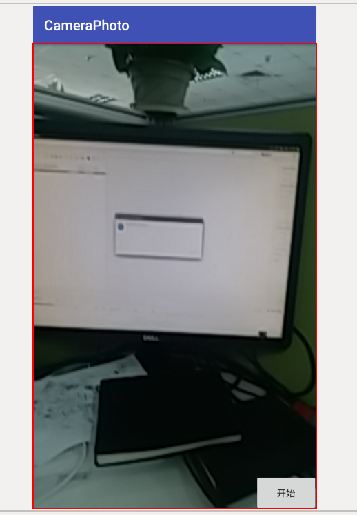
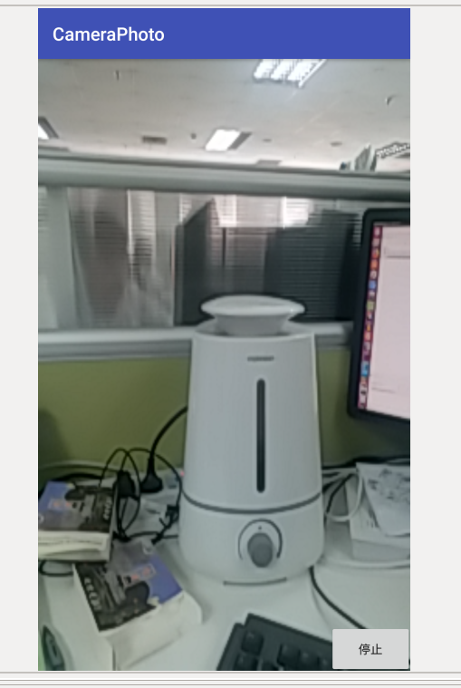

如果您觉得该项目对您有用，请扫描以下二维码打赏1元，多多支持

AVMediaCodecMP4工程 \
Android平台Camera采集预览nv21格式数据，AudioRecord采集音频pcm数据，使用MediaCodec分别进行h264和AAC硬编码，通过MediaMuxer合成MP4

软件运行界面 如下

点击开始按钮，开始录像，界面如下

点击停止按钮，会在手机存储zhongjihao目录下生成out.mp4文件，附带在三星C9上录出来的out.mp4文件

